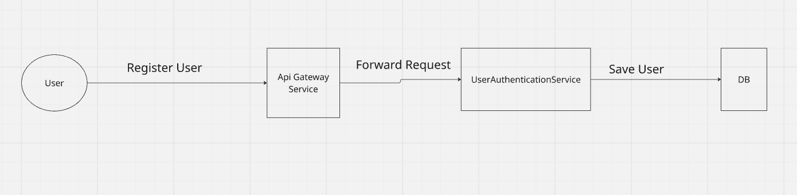
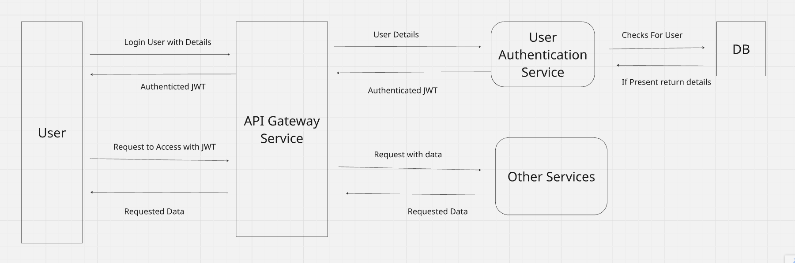
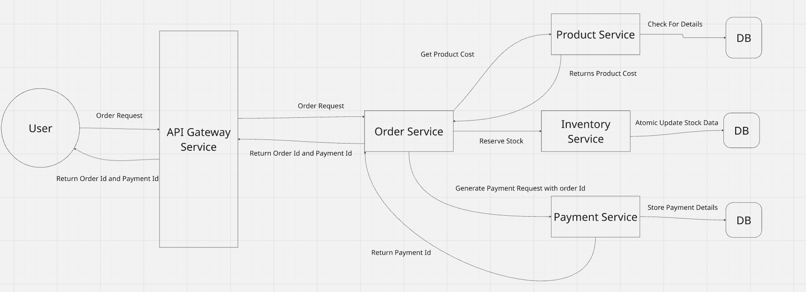
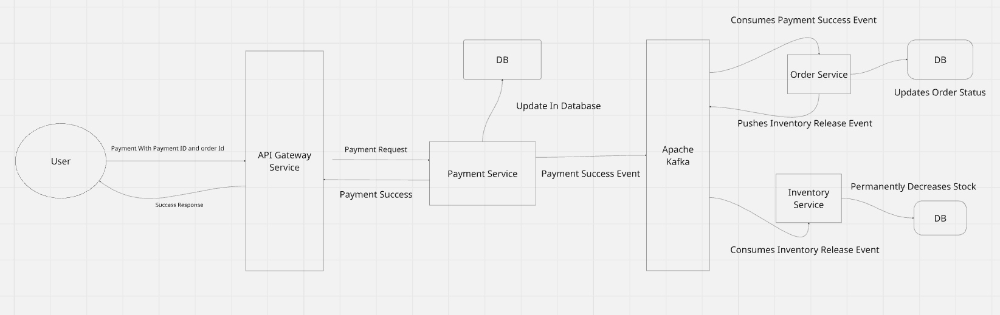

# 🛒 E-Commerce Microservices Backend

A scalable **microservices-based e-commerce backend** built using Java, Spring Boot, and Kafka.  
This project demonstrates real-world backend architecture with **API Gateway, Service Discovery, JWT Authentication, and Event-Driven Communication**.

---

## 🚀 Tech Stack

- Java
- Spring Boot
- Spring Cloud (Eureka)
- Apache Kafka
- REST APIs
- MySQL DB
- JWT Authentication

## 📦 Microservices Overview

### 🔹 API Gateway Service
- Entry point for all client requests  
- Authenticates JWT tokens  
- Routes requests using Eureka  

### 🔹 User Authentication Service
- Handles user registration and login  
- Generates and validates JWT tokens  

### 🔹 Product Service
- Stores product details (price, category, brand)  

### 🔹 Order Service
- Core service handling order lifecycle  
- Publishes and consumes Kafka events  

### 🔹 Inventory Service
- Manages stock and availability  

### 🔹 Payment Service
- Mock payment gateway  
- Handles payment success/failure  

### 🔹 Service Registry (Eureka)
- Enables service discovery  

  # 🔄 Application Flows

## 🧾 1. User Registration Flow

<p align="center">
  
</p>

---

## 🔐 2. User Login Flow

<p align="center">
  
</p>

---

## 🛒 3. Order Creation Flow

<p align="center">
  
</p>

---

## 💳 4. Payment Success Flow

<p align="center">
  
</p>

## 🗄️ Database Schema (Service-wise)

---

### 🔹 Product Service

**products**
```sql
CREATE TABLE products (
    id BIGINT PRIMARY KEY AUTO_INCREMENT,
    name VARCHAR(255) NOT NULL,
    description TEXT,
    price DECIMAL(12,2) NOT NULL,
    category_id BIGINT,
    brand VARCHAR(100),
    image BLOB,
    seller_id BIGINT,
    is_active BOOLEAN DEFAULT TRUE,
    created_at TIMESTAMP DEFAULT CURRENT_TIMESTAMP,
    updated_at TIMESTAMP DEFAULT CURRENT_TIMESTAMP ON UPDATE CURRENT_TIMESTAMP
);
```

**categories***
```sql
CREATE TABLE categories (
    id BIGINT PRIMARY KEY AUTO_INCREMENT,
    name VARCHAR(150) NOT NULL UNIQUE,
    description TEXT,
    created_at TIMESTAMP DEFAULT CURRENT_TIMESTAMP
);

Indexes

CREATE INDEX idx_products_category ON products(category_id);
CREATE INDEX idx_products_active ON products(is_active);
CREATE INDEX idx_products_name ON products(name);
```

**Inventory Service**

```sql

CREATE TABLE inventory (
    id BIGINT PRIMARY KEY AUTO_INCREMENT,
    product_id BIGINT NOT NULL UNIQUE,
    available_quantity INT NOT NULL DEFAULT 0,
    reserved_quantity INT NOT NULL DEFAULT 0,
    version INT DEFAULT 0,
    created_at TIMESTAMP DEFAULT CURRENT_TIMESTAMP,
    updated_at TIMESTAMP DEFAULT CURRENT_TIMESTAMP ON UPDATE CURRENT_TIMESTAMP
);

order_processed

CREATE TABLE order_processed (
    id BIGINT AUTO_INCREMENT PRIMARY KEY,
    order_id BIGINT NOT NULL,
    product_id BIGINT NOT NULL,
    quantity BIGINT NOT NULL,
    reason VARCHAR(100) NOT NULL,
    created_at TIMESTAMP DEFAULT CURRENT_TIMESTAMP
);
```

**Order Service**

```sql


CREATE TABLE orders (
    id BIGINT PRIMARY KEY AUTO_INCREMENT,
    user_id BIGINT NOT NULL,
    status VARCHAR(20) NOT NULL,
    total_amount DECIMAL(12,2) NOT NULL,
    currency VARCHAR(10) DEFAULT 'INR',
    created_at TIMESTAMP DEFAULT CURRENT_TIMESTAMP,
    updated_at TIMESTAMP DEFAULT CURRENT_TIMESTAMP ON UPDATE CURRENT_TIMESTAMP,

    INDEX idx_user_id (user_id)
);

CREATE TABLE order_items (
    id BIGINT PRIMARY KEY AUTO_INCREMENT,
    order_id BIGINT NOT NULL,
    product_id BIGINT NOT NULL,
    product_name VARCHAR(255),
    price DECIMAL(12,2) NOT NULL,
    quantity INT NOT NULL,
    total_price DECIMAL(12,2) NOT NULL,

    FOREIGN KEY (order_id) REFERENCES orders(id) ON DELETE CASCADE,
    INDEX idx_order_id (order_id)
);
```

**Payment Service**
```sql
CREATE TABLE payments (
    id BIGINT PRIMARY KEY AUTO_INCREMENT,
    order_id BIGINT NOT NULL,
    amount DECIMAL(10,2) NOT NULL,
    currency VARCHAR(10) NOT NULL DEFAULT 'INR',
    status VARCHAR(20) NOT NULL,
    created_at TIMESTAMP DEFAULT CURRENT_TIMESTAMP,
    updated_at TIMESTAMP DEFAULT CURRENT_TIMESTAMP ON UPDATE CURRENT_TIMESTAMP
);
```
## 🚀 Conclusion

This project demonstrates the design and implementation of a scalable, event-driven microservices architecture. It highlights key concepts such as service discovery, API gateway routing, asynchronous communication using Kafka, and distributed transaction handling using the Saga pattern.

The system is designed to be extensible, fault-tolerant, and production-ready, making it a strong foundation for real-world e-commerce platforms.
